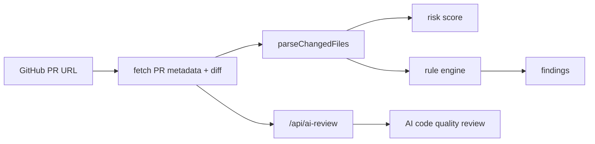

# Architecture

## Overview

AI PR Review Assistant 是一个 GitHub PR 链接驱动的自动审查工具。系统分为四层：

1. PR 导入层：解析 GitHub PR URL，拉取 PR 元数据和 diff。
2. 规则 Review 层：解析 diff，运行规则，生成评分和文案。
3. AI Review 层：后端调用 OpenAI-compatible Chat Completions 或 OpenAI Responses API，对 diff 进行代码质量评审。
4. 展示层：呈现风险指标、审查意见、AI 代码评审和变更文件统计。
5. 插件层：在 GitHub PR 页面内注入分析面板。



## Review Engine

`src/lib/reviewEngine.ts` 暴露两个主要函数：

- `parseChangedFiles(diff)`：解析 git diff 中的文件路径、状态和增删行。
- `analyzePullRequest(input)`：生成完整 `ReviewReport`。

规则结构：

```ts
type Rule = {
  id: string;
  severity: Severity;
  category: ReviewCategory;
  title: string;
  test: (input: ReviewInput, files: ChangedFile[]) => string | null;
  recommendation: string;
};
```

新增规则时只需要追加 `rules` 数组，并补充对应测试。

## GitHub Import

`src/lib/githubPullRequest.ts` 负责：

- `parseGitHubPullRequestUrl(url)`：校验并解析 GitHub PR URL。
- `fetchGitHubPullRequest(ref)`：调用本地/部署 API 代理读取 PR metadata 和 diff。
- `importGitHubPullRequest(url)`：组合解析和拉取流程，返回 `ReviewInput`。

`server/githubPullRequestCore.mjs` 负责服务端 GitHub 读取逻辑。页面通过 GitHub OAuth 登录建立 `HttpOnly` 会话 Cookie，后端也支持 `GITHUB_TOKEN` 环境变量，用于避免匿名 API rate limit。
`server/githubAuthCore.mjs` 负责 GitHub OAuth 授权跳转、state 校验、code 换 token 和退出登录。

## Frontend

`src/App.tsx` 保存当前 PR URL、导入状态和分析结果，通过 GitHub 导入模块获取 PR 内容，再调用 Review 引擎。页面分为：

- 顶部指标区：风险等级、风险分、变更文件数、审查点数。
- 左侧导入区：GitHub PR URL、导入状态、当前 PR 链接。
- 中央报告区：审查意见和 AI 代码评审。
- 右侧变更文件区：文件状态和增删行。

## Browser Extension

`extension/` 提供 Manifest V3 插件：

- `manifest.json`：声明 GitHub 页面 content script。
- `content.js`：在 GitHub PR 页面读取当前 URL、拉取 PR、运行规则并渲染结果。
- `content.css`：插件面板样式。

## AI Review API

AI 代码评审通过后端接口完成，支持页面传入第三方 OpenAI-compatible 模型配置：

- `server/aiReviewCore.mjs`：构造大模型评审 prompt，按协议调用 Chat Completions 或 Responses API，并解析结构化 JSON。
- `server/aiReviewServer.mjs`：本地开发 API 服务。
- `vite.config.js`：开发模式内置 `/api/ai-review` 中间件，避免只启动前端时出现代理 500。
- `api/ai-review.js`：Vercel 部署入口。

前端调用 `/api/ai-review` 时会传入 `协议`、`BASE_URL`、`API_KEY`、`MODEL`。后端也支持 `OPENAI_PROTOCOL`、`OPENAI_BASE_URL`、`OPENAI_API_KEY`、`OPENAI_MODEL` 作为默认配置。

协议选择：

- `chat_completions`：调用 `{BASE_URL}/chat/completions`，使用 `response_format: { type: "json_object" }` 获取 JSON 结果。
- `responses`：调用 `{BASE_URL}/responses`，使用 `text.format: { type: "json_schema" }` 约束 AI 评审结构。

## Future Extensions

- GitHub Enterprise 和更细粒度仓库授权。
- Gitee 支持：增加 Gitee PR URL 解析与 diff 拉取。
- LLM 增强：将规则命中结果发送给模型生成上下文修复建议。
- 团队规则：支持导入 YAML/JSON 自定义规则集。
